# CyberShield Nexus - University Project Documentation

Version: 1.0
Date: 2026-03-08
Prepared by: Software Engineer and Analyst Perspective

## 1. Introduction
CyberShield Nexus is a cybercrime assistance and intelligence platform designed to help citizens and organizations report cyber incidents, receive actionable guidance, and support authorities with structured, analyzable case data. The system combines incident reporting, evidence handling, analytics, and AI-assisted risk insights in one platform.

This documentation converts the product scope into a practical implementation draft suitable for a university project using only free resources and open-source tools.
It also supports free-tier managed platforms where they reduce implementation time.

## 2. Problem Statement
Cybercrime victims often face three practical issues:
1. They do not know the correct way to report incidents.
2. They do not get immediate, structured response guidance.
3. Authorities and analysts cannot easily detect patterns across isolated reports.

Current processes are fragmented across forms, emails, and manual follow-up, causing delayed response, poor evidence quality, and weak trend visibility.

## 3. Objectives
1. Build a guided incident reporting workflow for cybercrime victims.
2. Implement secure evidence upload with integrity verification.
3. Provide case tracking with transparent status lifecycle.
4. Add AI-assisted classification and severity scoring for triage.
5. Offer role-based dashboards for citizen, officer, analyst, and admin.
6. Generate actionable alerts and basic regional risk intelligence.
7. Deliver an MVP that can run locally and on free-tier hosting.

## 4. Existing System
Common existing systems are typically:
1. Generic complaint portals with minimal cyber-specific guidance.
2. Manual reporting through email or paper processes.
3. Separate tools for case tracking, evidence storage, and analytics.
4. Limited or no AI triage, resulting in slow prioritization.

Limitations:
1. Inconsistent report quality and missing critical fields.
2. Weak chain-of-custody for digital evidence.
3. Low visibility of district-level cyber trends.
4. Delayed communication to victims and investigators.

## 5. Proposed System
CyberShield Nexus will provide an integrated, role-aware platform with:
1. Adaptive incident reporting forms.
2. Secure evidence upload and SHA-256 file hashing.
3. Case lifecycle tracking (Submitted -> Under Review -> Analysis Complete -> Assigned -> Investigating -> Resolved/Closed).
4. AI pipeline for crime-type classification and severity scoring.
5. Personalized guidance checklists per incident type.
6. Dashboard views for reporting, analytics, and alerts.

Practical implementation approach (free resources only):
1. Build backend with FastAPI and PostgreSQL.
2. Build frontend with Next.js and Tailwind CSS.
3. Run async jobs using Celery with Redis (all open source).
4. Use free map stack with Leaflet + OpenStreetMap.
5. Use scikit-learn models first; add transformer models only after MVP stability.

Practical implementation approach (free-tier managed acceleration):
1. Use Clerk for user authentication in Next.js.
2. Use Supabase Postgres as managed database and Supabase Storage for evidence objects.
3. Keep FastAPI as domain API and AI pipeline service.
4. Verify Clerk JWT in FastAPI using Clerk JWKS before applying RBAC rules.
5. Use Celery + Redis (self-hosted/local) for analysis jobs if queue features are needed beyond basic API requests.

## 6. Modules of the Project
### 6.1 Authentication and Role Management
- Register/login with JWT.
- Role-based access control (citizen, officer, analyst, admin).
- Optional TOTP 2FA for sensitive roles.

### 6.2 Incident Reporting Module
- Multi-step form with required cybercrime fields.
- Crime-type suggestion based on user description.
- Draft save and final submit.

### 6.3 Evidence Management Module
- File upload for image/PDF initially.
- SHA-256 hash generation and storage.
- Antivirus scan using ClamAV.
- Evidence metadata linked to case.

### 6.4 Case Tracking Module
- Status timeline with timestamps.
- Officer assignment and update history.
- Victim-facing progress visibility.

### 6.5 AI Analysis Module
- Text classification for incident category.
- Rule + ML severity scoring (1-10).
- Extract indicators (emails, URLs, phone numbers) via regex/spaCy.

### 6.6 Guidance Module
- Template-driven action steps by crime type and severity.
- Immediate, short-term, and long-term actions.
- Downloadable case summary.

### 6.7 Alerts Module
- Publish alert advisories by region/crime type.
- In-app alerts and email notifications.
- Alert expiry and archive.

### 6.8 Analytics and Risk Module
- KPI cards, trend charts, and type distribution.
- Region-level risk scoring from aggregated incidents.
- Basic forecasting (7-30 day trend).

### 6.9 Admin and Audit Module
- User approvals, role assignment, account status changes.
- Audit logs for sensitive actions.
- Basic platform health checks.

## 7. Technologies to be Used (Free and Practical)
### 7.1 Frontend
1. Next.js (React, TypeScript) - open source.
2. Tailwind CSS - open source styling.
3. Recharts - free charting.
4. Leaflet + OpenStreetMap - free map visualization.

### 7.2 Backend
1. FastAPI (Python) - open source, fast development.
2. SQLAlchemy + Alembic - ORM and migrations.
3. Pydantic - request/response validation.
4. Uvicorn - ASGI server.

### 7.3 Data and Storage
1. PostgreSQL - free relational database.
2. Redis - free caching and background queue broker.
3. MinIO (optional local object storage) or filesystem storage for MVP evidence.
4. pgAdmin/DBeaver Community - free DB tooling.

### 7.4 AI/ML
1. scikit-learn - classification and baseline models.
2. pandas, numpy - data handling.
3. spaCy (small model) - entity extraction.
4. Prophet alternative: statsmodels or simple moving-average forecasting for MVP.

### 7.5 Security and Ops
1. JWT auth (PyJWT/python-jose).
2. passlib + bcrypt for password hashing.
3. ClamAV for file scanning.
4. Docker Compose for local orchestration.
5. GitHub Actions free tier for CI.

### 7.6 Suggested Free Deployment Options
1. Frontend: Vercel free tier.
2. Backend: Render free tier or Railway hobby free credits (if available in your region).
3. Database: Supabase free Postgres or Neon free Postgres.
4. Alternative fully local demo: run all services via Docker Compose on laptop.

Note: Free tiers can have sleep limits. For university demo reliability, keep a local Docker demo environment ready.

### 7.7 Optional Accelerated Stack (Using Platforms Like Clerk and Supabase)
1. Clerk (free tier): authentication UI, session handling, social login, MFA support.
2. Supabase (free tier): managed PostgreSQL, file storage, row-level security, SQL editor.
3. FastAPI remains useful for business logic, AI scoring, and custom incident workflows.
4. Suggested integration pattern:
    - Frontend signs in with Clerk.
    - Frontend sends Clerk access token to FastAPI.
    - FastAPI validates token via Clerk JWKS and maps user role to internal RBAC.
    - FastAPI reads/writes incident data in Supabase Postgres.
    - Evidence files are uploaded to Supabase Storage with server-side validation and hash tracking.
5. This path is faster for university delivery, but keep migration scripts and service boundaries clear to avoid vendor lock-in.

## 8. System Architecture

### 8.1 Advanced System Architecture Diagram

```mermaid
flowchart TB
    subgraph CLIENTS["Client Layer"]
        direction LR
        CIT["🛡️ Citizen\nBrowser"]
        OFF["👮 Officer\nBrowser"]
        ANL["📊 Analyst\nBrowser"]
        ADM["⚙️ Admin\nBrowser"]
    end

    subgraph CDN["Edge and Delivery Layer"]
        direction LR
        VCL["Vercel CDN\nStatic Assets\nEdge Caching"]
    end

    subgraph AUTH["Authentication Layer"]
        direction LR
        CLK["Clerk\nAuth Service"]
        JWKS["JWKS Endpoint\nPublic Key Set"]
    end

    subgraph FRONTEND["Presentation Layer — Next.js 14 App Router"]
        direction LR
        PAGES["Pages\nLanding · Dashboard\nReport · Evidence\nCase · Map · Analytics\nAdmin · Profile\nKnowledge Center"]
        UIKIT["UI Components\nshadcn/ui\nTailwind CSS"]
        STATE["Client State\nReact Query\nZustand Store"]
        MAPS["Map Engine\nLeaflet.js\nOpenStreetMap"]
        CHARTS["Charts Engine\nRecharts"]
    end

    subgraph APIGW["API Gateway Layer — FastAPI"]
        direction LR
        JWTV["JWT Verification\nClerk JWKS\nRole Extraction"]
        RATE["Rate Limiter\nSlowAPI"]
        RBAC["RBAC Middleware\nRoute Guards\nRow-Level Checks"]
        VALID["Request Validation\nPydantic Models"]
    end

    subgraph SERVICES["Application Service Layer — FastAPI Routers"]
        direction LR
        CASE_SVC["Case Service\nCreate · Read\nUpdate · Assign\nEscalate · Close"]
        EVID_SVC["Evidence Service\nUpload · Hash\nScan · Metadata\nDownload"]
        ALERT_SVC["Alert Service\nCreate · Publish\nExpire · Archive"]
        ANALYTICS_SVC["Analytics Service\nAggregation\nKPI Computation\nExport"]
        GUIDE_SVC["Guidance Service\nTemplate Engine\nAction Plans\nPDF Generation"]
        USER_SVC["User Service\nProfile · Roles\nAudit Logs"]
    end

    subgraph ASYNC["Async Processing Layer"]
        direction LR
        QUEUE["Redis Queue\nCelery Broker"]
        WORKER["Celery Worker\nTask Execution"]
        DLQ["Dead Letter Queue\nFailed Job Retry"]
    end

    subgraph ML["AI and ML Pipeline Layer — Python"]
        direction LR
        NLP["NLP Classifier\nscikit-learn\nDistilBERT"]
        ENT["Entity Extractor\nspaCy\nRegex Patterns"]
        SEV["Severity Scorer\nRule Engine\nML Hybrid"]
        RISK["Risk Predictor\nTime-Series\nAggregation"]
    end

    subgraph DATA["Data Layer"]
        direction LR
        PG["Supabase PostgreSQL\nUsers · Cases\nEvidence Meta\nAlerts · Risk\nAudit Logs\nGuidance Templates"]
        REDIS["Redis\nSession Cache\nJWT Blocklist\nRate Counters"]
        STORAGE["Supabase Storage\nEvidence Files\nAES-256 Encrypted\nSHA-256 Hashed"]
    end

    subgraph NOTIFY["Notification Layer"]
        direction LR
        EMAIL["Email Service\nResend Free Tier\nCase Updates\nAlert Broadcasts"]
        INAPP["In-App Notifications\nWebSocket or Polling\nReal-Time Alerts"]
    end

    subgraph MONITOR["Observability Layer"]
        direction LR
        LOGS["Structured Logging\nPython logging\nJSON Format"]
        HEALTH["Health Checks\n/health Endpoint\nDB · Redis · Storage"]
        SENTRY["Error Tracking\nSentry Free Tier\nException Alerts"]
    end

    %% Client connections
    CIT & OFF & ANL & ADM --> VCL
    VCL --> FRONTEND
    CIT & OFF & ANL & ADM --> CLK
    CLK --> JWKS

    %% Frontend internals
    PAGES --> UIKIT
    PAGES --> STATE
    PAGES --> MAPS
    PAGES --> CHARTS

    %% Frontend to Backend
    FRONTEND -->|"Bearer Token\nHTTPS REST"| APIGW

    %% API Gateway internals
    JWTV --> JWKS
    APIGW --> JWTV
    APIGW --> RATE
    APIGW --> RBAC
    APIGW --> VALID

    %% Gateway to Services
    APIGW --> SERVICES

    %% Service to Data
    CASE_SVC & EVID_SVC & ALERT_SVC & ANALYTICS_SVC & GUIDE_SVC & USER_SVC --> PG
    EVID_SVC --> STORAGE
    CASE_SVC & ALERT_SVC --> REDIS

    %% Async flow
    CASE_SVC -->|"New Case Event"| QUEUE
    QUEUE --> WORKER
    WORKER --> ML
    WORKER -->|"Failed Jobs"| DLQ
    DLQ -->|"Retry"| WORKER

    %% ML outputs
    NLP & ENT & SEV --> PG
    RISK --> PG

    %% Notifications
    CASE_SVC & ALERT_SVC --> EMAIL
    CASE_SVC & ALERT_SVC --> INAPP

    %% Monitoring
    SERVICES --> LOGS
    APIGW --> HEALTH
    SERVICES --> SENTRY

    %% Styling
    classDef clientStyle fill:#E3F2FD,stroke:#1565C0,stroke-width:2px,color:#0D47A1
    classDef authStyle fill:#F3E5F5,stroke:#7B1FA2,stroke-width:2px,color:#4A148C
    classDef feStyle fill:#E8F5E9,stroke:#2E7D32,stroke-width:2px,color:#1B5E20
    classDef gwStyle fill:#FFF3E0,stroke:#E65100,stroke-width:2px,color:#BF360C
    classDef svcStyle fill:#FFFDE7,stroke:#F9A825,stroke-width:2px,color:#F57F17
    classDef asyncStyle fill:#FCE4EC,stroke:#C62828,stroke-width:2px,color:#B71C1C
    classDef mlStyle fill:#E1F5FE,stroke:#0277BD,stroke-width:2px,color:#01579B
    classDef dataStyle fill:#F1F8E9,stroke:#558B2F,stroke-width:2px,color:#33691E
    classDef notifyStyle fill:#FFF8E1,stroke:#FF8F00,stroke-width:2px,color:#FF6F00
    classDef monitorStyle fill:#ECEFF1,stroke:#546E7A,stroke-width:2px,color:#37474F

    class CIT,OFF,ANL,ADM clientStyle
    class CLK,JWKS authStyle
    class VCL,PAGES,UIKIT,STATE,MAPS,CHARTS feStyle
    class JWTV,RATE,RBAC,VALID gwStyle
    class CASE_SVC,EVID_SVC,ALERT_SVC,ANALYTICS_SVC,GUIDE_SVC,USER_SVC svcStyle
    class QUEUE,WORKER,DLQ asyncStyle
    class NLP,ENT,SEV,RISK mlStyle
    class PG,REDIS,STORAGE dataStyle
    class EMAIL,INAPP notifyStyle
    class LOGS,HEALTH,SENTRY monitorStyle
```



### 8.2 Layer Descriptions

| Layer | Components | Responsibility |
|-------|-----------|----------------|
| **Client Layer** | Browser clients per role | Role-specific UI access points |
| **Edge and Delivery** | Vercel CDN | Static asset delivery, edge caching, SSL |
| **Authentication** | Clerk + JWKS | User sign-up/login, session tokens, MFA, social auth |
| **Presentation** | Next.js, shadcn/ui, Leaflet, Recharts | All UI pages, maps, charts, client state |
| **API Gateway** | FastAPI middleware stack | JWT verification, rate limiting, RBAC, input validation |
| **Application Services** | 6 FastAPI router modules | Case, Evidence, Alert, Analytics, Guidance, User management |
| **Async Processing** | Redis + Celery + DLQ | Background AI jobs, retry on failure, decoupling |
| **AI/ML Pipeline** | scikit-learn, spaCy, rule engine | Classification, entity extraction, severity scoring, risk prediction |
| **Data Layer** | Supabase Postgres, Redis, Supabase Storage | Persistent storage, caching, encrypted evidence files |
| **Notification** | Email (Resend), In-App | Case updates, threat alerts, status change notifications |
| **Observability** | Logging, Health checks, Sentry | Structured logs, uptime monitoring, error tracking |

### 8.3 Key Data Flows

**Flow 1 — Incident Reporting:**
```
Citizen → Clerk Auth → Next.js Form → FastAPI (JWT + RBAC) → Case Service
→ PostgreSQL (case record) → Redis Queue → Celery Worker → NLP Classifier
→ Severity Scorer → PostgreSQL (analysis result) → Email Notification → Dashboard Update
```

**Flow 2 — Evidence Upload:**
```
Citizen → Next.js Dropzone → FastAPI (validate type + size) → SHA-256 Hash
→ ClamAV Scan → Supabase Storage (encrypted) → PostgreSQL (evidence metadata)
→ spaCy Entity Extraction (async) → Case Record Updated
```

**Flow 3 — Officer Case Review:**
```
Officer → Clerk Auth → Next.js Dashboard → FastAPI (JWT + officer role check)
→ Case Service (jurisdiction filter, severity sort) → PostgreSQL
→ Evidence Download (audit logged) → Status Update → Citizen Notification
```

**Flow 4 — Risk Scoring:**
```
Scheduled Job → Aggregate Incidents by Region → Feature Computation
→ Risk Model Inference → Risk Score per Region → PostgreSQL
→ Threshold Check → Alert Generation → Multi-Channel Notification
```

## 9. Expected Outcomes
1. A working cybercrime reporting platform with secure evidence support.
2. Faster triage using AI-assisted classification and severity scoring.
3. Better transparency with case status tracking for victims.
4. Officer productivity improvement through prioritized case queues.
5. Basic district-level risk insights and alert generation.
6. A complete MVP suitable for academic evaluation and future extension.

Measurable MVP targets:
1. Incident form completion in less than 5 minutes for typical case.
2. Evidence upload plus hash generation in less than 30 seconds for small files.
3. Classification accuracy above 80 percent on test dataset.
4. Stable operation for at least 100 concurrent users in controlled testing.

## 10. References
1. FastAPI Documentation: https://fastapi.tiangolo.com/
2. PostgreSQL Documentation: https://www.postgresql.org/docs/
3. SQLAlchemy Documentation: https://docs.sqlalchemy.org/
4. Next.js Documentation: https://nextjs.org/docs
5. Tailwind CSS Documentation: https://tailwindcss.com/docs
6. Leaflet Documentation: https://leafletjs.com/
7. OpenStreetMap: https://www.openstreetmap.org/
8. scikit-learn Documentation: https://scikit-learn.org/stable/
9. spaCy Documentation: https://spacy.io/usage
10. ClamAV Documentation: https://docs.clamav.net/
11. Redis Documentation: https://redis.io/docs/
12. Docker Documentation: https://docs.docker.com/
13. OWASP ASVS and Top 10: https://owasp.org/
14. Clerk Documentation: https://clerk.com/docs
15. Supabase Documentation: https://supabase.com/docs

---

## Recommended Stack for This Project

After evaluating both pure open-source and managed free-tier options, the recommended implementation stack for this university project is:

### Final Technology Decision

**Frontend:**
- Next.js 14+ (App Router) with TypeScript
- Tailwind CSS + shadcn/ui components
- Recharts for analytics visualization
- Leaflet + OpenStreetMap for heatmap

**Authentication:**
- Clerk (free tier: up to 10,000 MAUs)
- Reasons: Built-in session management, social login, MFA, role metadata support, production-ready security

**Backend API:**
- FastAPI (Python 3.11+)
- Reasons: Fast async performance, automatic OpenAPI docs, strong typing with Pydantic, Python ML ecosystem compatibility

**Database:**
- Supabase Postgres (free tier: 500 MB database, unlimited API requests)
- Reasons: Managed backups, built-in auth policies (even if not used for primary auth), SQL editor, PostGIS support

**File Storage:**
- Supabase Storage (free tier: 1 GB)
- Reasons: S3-compatible API, RLS policies, CDN delivery, SHA-256 hash support

**Caching and Queue:**
- Redis (local Docker during development; Upstash free tier for deployment: 10,000 commands/day)
- Celery for async ML jobs (optional; can start with direct calls for MVP)

**ML/AI:**
- scikit-learn for classification and risk scoring
- spaCy (en_core_web_sm) for entity extraction
- pandas/numpy for data processing

**Deployment:**
- Frontend: Vercel (free tier, auto-deployment from GitHub)
- Backend: Render (free tier with 750 free hours/month)
- Database: Supabase cloud (free tier)
- Redis: Upstash (free tier) or local Docker for development

### Why This Stack?

1. **Zero mandatory costs** - All platforms have generous free tiers suitable for university projects.
2. **Fast development** - Clerk eliminates weeks of auth implementation; Supabase provides instant Postgres.
3. **Production patterns** - Same architecture used in real startups, demonstrating professional engineering knowledge.
4. **Easy demo** - Deployed URLs work reliably without sleep/wake delays during university presentations.
5. **Local fallback** - Everything can run via Docker Compose locally if internet/cloud access fails during demo.
6. **Learning value** - Shows understanding of both managed services and underlying technologies.

### Integration Architecture

```
User Browser
    ↓
[Clerk Auth Widget] → Session Token
    ↓
Next.js Frontend (Vercel)
    ↓
Bearer Token → FastAPI Backend (Render)
    ↓
[JWT Verification via Clerk JWKS]
    ↓
Business Logic + ML Pipeline
    ↓
Supabase Postgres ← Data
Supabase Storage ← Evidence Files
Upstash Redis ← Cache/Queue
```

### Fallback Plan for Demo Day

If any cloud service is unreachable:
1. Run `docker compose up` for local Postgres + Redis
2. Run FastAPI with local JWT secret (bypass Clerk verification)
3. Run Next.js in dev mode against localhost backend
4. All features still work; only cloud URLs become localhost

This guarantees a successful demo regardless of network conditions.

---

## Implementation Suggestions from Software Engineer and Analyst Perspective
1. Start with narrow MVP scope first: incident reporting, evidence upload, officer queue, and basic analytics.
2. Use deterministic rules with simple ML before complex transformer pipelines to avoid over-engineering.
3. Keep every major function behind clear service layers (auth, case, evidence, analytics) to reduce coupling.
4. Use migration-first database workflow with Alembic to avoid schema drift.
5. Maintain audit logs for every sensitive action (download evidence, role change, case reassignment).
6. Add unit tests for scoring logic and API contract tests for incident/evidence endpoints.
7. Use synthetic data for model training to avoid privacy/legal issues in university environment.
8. Design failure-safe evidence workflow: if scan fails, keep file quarantined and block officer download.
9. For demo confidence, prepare both cloud free-tier deployment and local Docker fallback.
10. Document assumptions, limitations, and deferred features explicitly in final report to show engineering maturity.
11. **Integration checkpoint**: Verify Clerk token validation in FastAPI before building case endpoints.
12. **Storage checkpoint**: Test Supabase Storage upload + hash verification before building evidence workflows.
13. **Keep service boundaries clean**: FastAPI should never depend on Clerk SDK directly; only verify JWT and extract claims.
